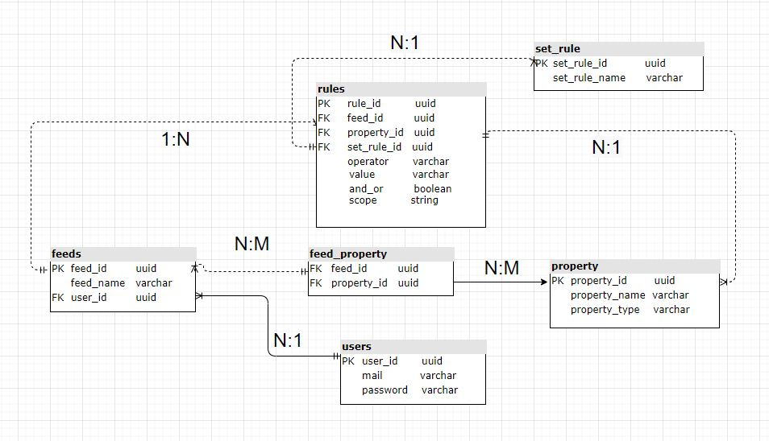
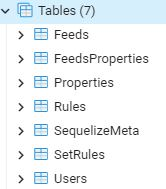

# Server Side Node.js

## Getting Started
1. Make sure you have *Node.js* 16 or higher and *npm* 6 or higher and *PostgreSQL* 14 or higher installed
2. Make sure you have installed TypeScript package globally
3. Install the project dependencies by running `npm install` from the project's directory
4. Run the project by running `npm run dev`
5. Run seeds by running `npm run seed`
6. Import postman collections from the project's directory into your Postman

> **_NOTE:_**  Do not use in migration script, The tables will be created after you run the service and only then You should to run seed script

You should now have the development version running on your computer and accessible via http://localhost:8080

## DB Diagram

## Screen shot of PgAdmin tables

